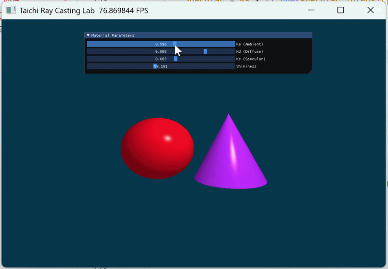

# Taichi 局部光照与光线投射渲染器 (Ray Casting & Phong Shading)

基于 [Taichi](https://github.com/taichi-dev/taichi) 框架实现的交互式三维光线投射 (Ray Casting) 渲染器。本项目通过纯数学隐式方程定义了几何体，并实现了经典的 Phong 光照模型与实时 UI 交互。

## ✨ 效果预览
 
*(图注：实时调节材质参数 Ka, Kd, Ks 与 Shininess 对渲染结果的影响)*

## 🎯 核心特性

- **光线求交计算 (Ray Casting)**：通过解一元二次方程，完全基于代码隐式实现了**球体 (Sphere)** 和**有限高度圆锥 (Cone)** 的光线碰撞检测与法向量计算。
- **深度竞争 (Z-Buffer 逻辑)**：正确处理多物体前后的遮挡关系，始终渲染距离相机最近的交点。
- **Phong 局部光照模型**：
  - **Ambient (环境光)**：模拟场景底光。
  - **Diffuse (漫反射)**：基于 Lambert 定律模拟粗糙表面反射。
  - **Specular (镜面高光)**：基于视线与反射向量夹角模拟高光质感。
- **实时交互 (GUI)**：使用 `ti.ui.Window` 构建了控制面板，支持实时拖拽滑动条调节光照参数。

## 🛠️ 环境依赖与运行

本项目依赖 Python 环境与 Taichi 高性能计算库。

**1. 安装依赖**
```bash
pip install taichi
```

**2. 运行程序**
```bash
python main.py
```

**3. 交互说明**
运行后将弹出一个带有 UI 控件的窗口。你可以通过调整左上角的滑块观察实时渲染效果：
- `Ka`: 环境光系数 (0.0 ~ 1.0)
- `Kd`: 漫反射系数 (0.0 ~ 1.0)
- `Ks`: 镜面高光系数 (0.0 ~ 1.0)
- `Shininess`: 高光指数 (1.0 ~ 128.0，值越大高光光斑越小且越亮)

---

## 📂 项目结构
```text
.
├── main.py        # 渲染器主程序 (包含求交逻辑、Shader与UI)
├── shadow.py      #阴影
├── Bling-Phong.py #进阶实现
├── preview.gif    # 效果预览动图
└── README.md      # 项目说明文档
```